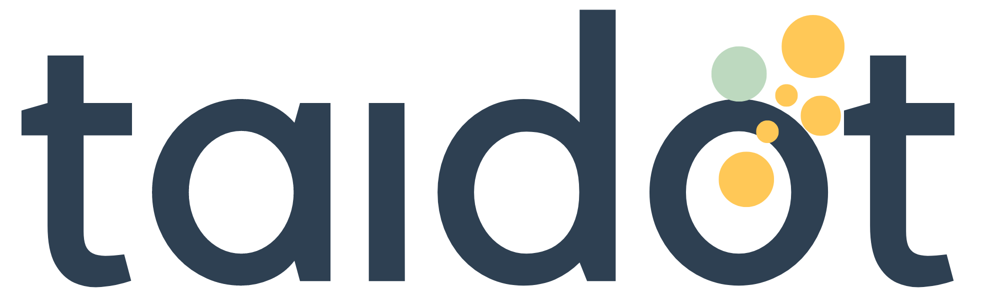

# Taidot – University Journey Planner

Taidot is a full-stack web application that helps students plan, organize, and manage their university application journey. Powered by OpenAI GPT-4.1 and real-time web search (SerpAPI), Taidot provides personalized, up-to-date guidance and resources for every step of the process.

## Features

- **University Program Search**
  - Search for official university programs worldwide.
  - Uses AI to generate effective search queries and SerpAPI to fetch accurate, detailed program information (including requirements, deadlines, and more).

- **Journey Management**
  - Save selected programs as "journeys" and track all relevant data for each.
  - View and manage multiple journeys in one place.

- **Admission Requirements Roadmap**
  - Automatically generates a step-by-step, interactive roadmap for each journey's admission requirements.
  - Mark steps as done/undone, with persistent progress tracking.

- **AI-Powered Todo Planning**
  - GPT-4.1 generates a personalized todo list for each user, based on all journeys' requirements and deadlines.
  - Todos are grouped, scheduled, and optimized to avoid missed deadlines and redundant work.

- **My Todos Page**
  - View all planned todos in a visually appealing, interactive list.
  - Mark todos as done/undone; click a todo to view details in a sliding popup.

- **Resource Popups**
  - For key tasks (CV, English language tests, motivation letter), the detail popup fetches and displays up-to-date, high-quality resources and guides using live web search.

- **Modern, Responsive UI**
  - Clean, modern design with a consistent color palette (#ffc857, #bcd9be, #2e4052), interactive components, and smooth transitions.

- **Persistent State**
  - All user actions (journey selection, roadmap progress, todo completion) are saved to the backend for a seamless experience across sessions.

## Tech Stack
- **Frontend:** Next.js (React), Tailwind CSS (or custom CSS)
- **Backend:** FastAPI (Python), OpenAI API, SerpAPI, SQLAlchemy (SQLite)
- **AI:** OpenAI GPT-4.1 for query and plan generation
- **Web Search:** SerpAPI for real-time Google search results

## License

This project is provided for educational and reference purposes only.  
All rights reserved © 2025 Xhemal Kodragjini.  
Do not copy, modify, or distribute without explicit permission.

---
For questions or contributions, please reach out to: Johana Cyri, Xhemal Kodragjini (xhemal.kodragjini98@gmail.com

## 🚀 Future Features & Extensions (Planned)

### 🌍 University Discovery for Open Explorers
For students who know what they want to study, but are open to suggestions on where.

### 🧠 Smart Discovery Workflow
- Select desired field of study and degree level (mandatory).
- Add background details: GPA, country of origin, etc.
- Apply optional filters:
  - Preferred continent/country/city
  - Tuition budget or scholarship-only
  - Year of intended admission
  - School rankings

### 🔍 AI-Based University Matching
- Scrapes universities matching filters.
- Analyzes module handbooks and official documents.
- Summarizes:
  - Required credits/courses
  - Needed documents and certifications
  - Application deadlines
  - Exam requirements
- Each result becomes a "dossier" with links and structured notes.

### 🗂️ From Discovery to Action
- After selecting preferred programs, user creates journeys just like in the current app.
- AI generates a roadmap and todo plan based on those requirements.

### 📝 Additional Manual Task Management
- Handles country-specific tasks:
  - Document translation
  - Document certification
  - Submission steps
  - Visa applications

### 🧭 Life Planning Features
- AI helps plan when to start each step.
- Tracks completion status and offers real-time progress updates.

### 💬 Long-Term Vision
- Start early: App supports users from high school years to begin planning ahead.
- Personal academic advice: “I got this grade – can I apply to this university?” → Receive academic recommendations (e.g., study more math, take specific tests).
- Connect with alumni mentors: Alumni share journeys and serve as peer advisors.
- Daily AI assistant: Chat interface to ask questions like "What should I work on today?"
- Documented university guide: Full walkthrough of university applications, requirements, and life abroad—organized in-app.
